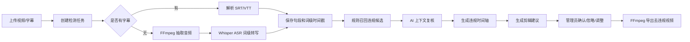

# AI 敏感词检测系统 / AI Sensitive Word Detection System

## 中文版

### 项目简介

AI 敏感词检测系统是一个基于 `Spring Boot + React` 的视频内容审核工作台。系统支持维护敏感词/违规词库，上传视频或字幕，通过 FFmpeg 抽取音频，使用本地 Whisper ASR 生成词级时间戳，再通过规则召回和 AI 上下文复核判断是否违规，最终生成可确认、可调整、可导出的视频剪辑建议。

该项目的核心目标不是直接依赖“整段视频多模态审核”，而是构建一个可审计、可解释、可定位到时间轴的审核流程。

### 核心能力

- 违规词库维护：支持新增、编辑、删除、启停、CSV 导入。
- 多种匹配方式：精确词、变体词、正则词、语义规则。
- 视频上传：支持视频文件上传，可选上传 `.srt/.vtt` 字幕。
- 音频抽取：通过 FFmpeg 将视频音频转为 16kHz mono wav。
- Whisper ASR：通过本地 `openai/whisper` 服务生成句段和词级时间戳。
- 简体中文输出：ASR 使用简体中文提示词，并用 OpenCC 做繁转简兜底。
- 规则召回：先用词库规则找到候选命中，降低 AI 审核成本。
- AI 复核：对接 OpenAI 兼容接口（Chat Completions 与 Responses 两种形态可配置切换），只复核候选上下文，输出违规判断、原因和置信度。
- 置信度把关：只有 AI 确认违规且置信度达到阈值（默认 0.6）的命中才进入违规时间轴并生成剪辑，低置信命中保留记录与原因但不自动剪，减少误剪。
- 时间轴展示：展示违规词出现的起止时间，并附 AI 置信度与判定原因。
- 剪辑建议：基于 Whisper 词级时间戳，按命中词前后各留白 `app.clip.padding-seconds`（默认 0.2 秒）生成剪辑片段，避免切掉过多时间轴。
- 管理员确认：确认、忽略或手动调整剪辑片段。
- 视频导出：确认后调用 FFmpeg 导出去违规版本视频。

### 技术栈

| 模块 | 技术 |
| --- | --- |
| 后端 | Spring Boot 3.3, Java 21, MyBatis-Plus, MySQL |
| 前端 | React 18, TypeScript, Vite, Ant Design |
| ASR | FastAPI, openai-whisper, OpenCC |
| 媒体处理 | FFmpeg, ffprobe |
| 数据库 | MySQL 8+ |

### 项目结构

```text
.
├── backend/      # Spring Boot 后端 API、检测管线、MyBatis-Plus Mapper
├── frontend/     # React + Vite 前端审核工作台
├── asr-service/  # FastAPI + openai/whisper 本地 ASR 服务
└── README.md
```

### 检测流程



### 环境要求

- Java 21
- Maven 3.9+
- Node.js 18+
- MySQL 8+
- Python 3.10
- FFmpeg / ffprobe

当前默认配置：

- 后端端口：`8090`
- 前端端口：`5174`
- ASR 服务端口：`9000`
- MySQL：`root/root`
- 数据库：`video_moderation`

### MySQL

后端默认使用 MySQL，并在启动时自动执行 `backend/src/main/resources/schema-mysql.sql` 建表。

默认配置位于 `backend/src/main/resources/application.yml`：

```yaml
spring:
  datasource:
    url: jdbc:mysql://localhost:3306/video_moderation?useUnicode=true&characterEncoding=utf8&serverTimezone=Asia/Shanghai&useSSL=false&allowPublicKeyRetrieval=true&createDatabaseIfNotExist=true
    username: root
    password: root
```

### FFmpeg

后端默认读取：

```text
backend/tools/ffmpeg/bin/ffmpeg.exe
backend/tools/ffmpeg/bin/ffprobe.exe
```

该目录不会提交到 Git。你可以：

1. 将 Windows 版 FFmpeg 放到上述目录。
2. 或通过环境变量覆盖路径：

```powershell
$env:FFMPEG_PATH='D:\path\to\ffmpeg.exe'
$env:FFPROBE_PATH='D:\path\to\ffprobe.exe'
```

### 启动 ASR 服务

```powershell
cd asr-service
py -3.10 -m venv .venv
.\.venv\Scripts\python.exe -m pip install --upgrade pip
.\.venv\Scripts\pip.exe install -r requirements.txt

$env:WHISPER_MODEL='large-v3'
$env:WHISPER_DEVICE='cpu'
$env:WHISPER_FP16='false'
$env:WHISPER_LANGUAGE='zh'
$env:WHISPER_CHINESE_CONVERTER='t2s'
$env:WHISPER_INITIAL_PROMPT='请使用简体中文转写普通话内容。'

.\.venv\Scripts\python.exe -m uvicorn app:app --host 127.0.0.1 --port 9000
```

说明：

- 第一次识别会下载 Whisper 模型。
- `WHISPER_MODEL` 可改为 `tiny/base/small/medium/large/large-v3/turbo`。
- 当前默认使用 `large-v3`；CPU 环境会更慢，如只验证流程可临时改为 `base` 或 `small`。
- CPU 环境保持 `WHISPER_FP16=false`；使用 CUDA 时可按硬件情况改为 `true`。
- 默认输出会使用简体中文提示词，并通过 OpenCC 做繁转简。

### 启动后端

```powershell
cd backend
$env:JAVA_HOME='D:\Environment\jdk21'
$env:Path="$env:JAVA_HOME\bin;$env:Path"
mvn spring-boot:run
```

后端默认已开启 ASR：

```yaml
app:
  asr:
    enabled: true
    base-url: http://localhost:9000
```

如果你只想使用字幕文件检测，可以把 `app.asr.enabled` 改为 `false`。

### AI 复核（OpenAI 兼容）

AI 复核与剪辑参数支持**前台即时配置**：在界面右上角点击齿轮图标打开「系统设置」，修改后对新建的检测任务立即生效，无需改文件或重启后端。设置持久化在数据库 `app_settings` 表（单行）。

`application.yml` 中的 `app.ai.*` / `app.clip.*` 仅作为**首次启动的初始默认值**（数据库无记录时种子化）：

```yaml
app:
  ai:
    enabled: false          # 改为 true 启用 AI 复核
    api-type: chat          # chat = /v1/chat/completions；responses = /v1/responses
    base-url: http://localhost:11434
    api-key:                # 需要鉴权时填入，作为 Authorization: Bearer
    model: qwen2.5
    temperature: 0          # 设为负数则不下发该参数（适配不支持自定义温度的推理模型）
    confidence-threshold: 0.6  # 置信度阈值：低于该值的命中不进入时间轴/剪辑
    timeout-seconds: 60
  clip:
    padding-seconds: 0.2    # 剪辑在命中词前后各留白的秒数，越小切得越少
    precise-export: false   # true 时导出重编码以帧级精确切割；false 为快速流复制
```

说明：

- 这些项均可在前台「系统设置」中调整；`application.yml` 改动只影响数据库尚无记录时的首次种子化。
- 两种形态都使用结构化输出（`json_schema`，字段 `violation/confidence/category/reason`），并对仅支持 `json_object` 的国产网关 / Ollama 做了兼容兜底。
- `api-type=chat` 兼容性最广（Ollama、vLLM、one-api、new-api 等）；`api-type=responses` 用于 OpenAI 新版 Responses 接口，请确认你的服务商支持该端点。
- 置信度把关：命中经 AI 复核后，仅当 `violation=true` 且 `confidence >= confidence-threshold` 才标记为违规；其余置为安全状态，仍可在「命中与 AI 复核」表中查看其置信度与原因。
- 关闭 AI 时，规则命中按 0.70 置信度全部保留为违规，便于人工兜底。
- 出于安全考虑，`GET /api/v1/settings` 不回传明文 API Key，仅返回 `aiApiKeyConfigured` 标记是否已配置；前台保存时留空即保持原 Key 不变。

### 启动前端

```powershell
cd frontend
npm install
npm run dev
```

访问：

```text
http://127.0.0.1:5174/
```

### REST API

| 方法 | 路径 | 说明 |
| --- | --- | --- |
| `POST` | `/api/v1/videos` | 上传视频，可选 `subtitle` |
| `GET` | `/api/v1/videos` | 视频列表 |
| `GET` | `/api/v1/videos/{id}` | 视频详情 |
| `GET` | `/api/v1/videos/{id}/content` | 视频内容预览 |
| `POST` | `/api/v1/videos/{id}/jobs` | 创建检测任务 |
| `GET` | `/api/v1/jobs/{id}` | 查询任务进度 |
| `GET` | `/api/v1/jobs/{id}/segments` | 字幕句段 |
| `GET` | `/api/v1/jobs/{id}/hits` | 违规命中 |
| `GET` | `/api/v1/jobs/{id}/timeline` | 违规时间轴 |
| `GET` | `/api/v1/jobs/{id}/clip-suggestions` | 剪辑建议 |
| `POST` | `/api/v1/jobs/{id}/clip-suggestions` | 重新生成剪辑建议 |
| `PATCH` | `/api/v1/clip-suggestions/{id}` | 确认、忽略或调整剪辑 |
| `POST` | `/api/v1/videos/{id}/exports` | 导出去违规视频 |
| `GET/POST/PATCH/DELETE` | `/api/v1/terms` | 维护违规词 |
| `POST` | `/api/v1/terms/import` | CSV 导入违规词 |
| `GET` | `/api/v1/settings` | 读取系统设置（AI/剪辑，屏蔽 API Key） |
| `PUT` | `/api/v1/settings` | 更新系统设置（前台即时生效） |

### 价格/金额这类模糊表达

价格、金额、报价等表达不适合穷举维护。可以新增一条语义规则：

- 词条：`价格` 或 `金额`
- 分类：`价格`
- 匹配方式：`语义`
- 严重级别：按业务要求选择

系统会召回 `1块钱`、`1块`、`29.9`、`¥29.9`、`一百元` 等候选表达，再交给 AI 根据上下文判断是否真的违规。

### CSV 导入格式

违规词 CSV 列顺序：

```text
term,category,severity,matchType,variants
```

示例：

```csv
价格,价格,HIGH,SEMANTIC,
违禁词,敏感内容,CRITICAL,EXACT,
```

### 注意事项

- 本项目不会提交本地视频、模型、虚拟环境、FFmpeg 二进制文件。
- ASR 模型由 openai-whisper 首次运行时下载并缓存到本机。
- 真实生产环境建议增加鉴权、审计日志、对象存储、任务队列和模型服务监控。
- AI 复核只处理规则召回候选，不做全文无差别审核。

---

## English Version

### Overview

AI Sensitive Word Detection System is a video moderation console built with `Spring Boot + React`. It manages a sensitive-term dictionary, uploads videos or subtitle files, extracts audio with FFmpeg, transcribes speech with local Whisper ASR, maps terms to word-level timestamps, reviews candidate hits with AI, and generates editable clip suggestions for administrators.

The system is designed for auditability and precise timeline positioning instead of relying on a black-box multimodal video model.

### Key Features

- Sensitive-term management: create, edit, delete, enable, disable, and CSV import.
- Matching modes: exact terms, variants, regex, and semantic rules.
- Video upload: upload video files with optional `.srt/.vtt` subtitles.
- Audio extraction: convert video audio to 16kHz mono wav using FFmpeg.
- Whisper ASR: generate segment-level and word-level timestamps.
- Simplified Chinese output: ASR uses a Simplified Chinese prompt and OpenCC fallback conversion.
- Rule recall: find candidate hits before AI review.
- AI review: call an OpenAI-compatible API (Chat Completions or Responses, switchable via `app.ai.api-type`) to review only candidate contexts and return violation, confidence, and reason.
- Confidence gating: only hits the AI confirms as violations with `confidence >= app.ai.confidence-threshold` (default 0.6) enter the timeline and produce clips; low-confidence hits are kept and explained but not auto-clipped.
- Timeline view: show where sensitive words appear, with AI confidence and reason.
- Clip suggestions: based on Whisper word-level timestamps, padded by `app.clip.padding-seconds` (default 0.2s) on each side to avoid cutting too much.
- Admin confirmation: confirm, ignore, or adjust suggested clips.
- Export: generate moderated videos after confirmed clip removal.

### Tech Stack

| Layer | Stack |
| --- | --- |
| Backend | Spring Boot 3.3, Java 21, MyBatis-Plus, MySQL |
| Frontend | React 18, TypeScript, Vite, Ant Design |
| ASR | FastAPI, openai-whisper, OpenCC |
| Media | FFmpeg, ffprobe |
| Database | MySQL 8+ |

### Project Structure

```text
.
├── backend/      # Spring Boot APIs, detection pipeline, MyBatis-Plus mappers
├── frontend/     # React + Vite moderation console
├── asr-service/  # FastAPI + openai/whisper local ASR service
└── README.md
```

### Detection Pipeline


### Requirements

- Java 21
- Maven 3.9+
- Node.js 18+
- MySQL 8+
- Python 3.10
- FFmpeg / ffprobe

Default services:

- Backend: `8090`
- Frontend: `5174`
- ASR: `9000`
- MySQL: `root/root`
- Database: `video_moderation`

### MySQL

The backend uses MySQL by default and automatically initializes tables from `backend/src/main/resources/schema-mysql.sql`.

Default datasource:

```yaml
spring:
  datasource:
    url: jdbc:mysql://localhost:3306/video_moderation?useUnicode=true&characterEncoding=utf8&serverTimezone=Asia/Shanghai&useSSL=false&allowPublicKeyRetrieval=true&createDatabaseIfNotExist=true
    username: root
    password: root
```

### FFmpeg

The backend defaults to:

```text
backend/tools/ffmpeg/bin/ffmpeg.exe
backend/tools/ffmpeg/bin/ffprobe.exe
```

This directory is not committed. You can either place FFmpeg there or override paths:

```powershell
$env:FFMPEG_PATH='D:\path\to\ffmpeg.exe'
$env:FFPROBE_PATH='D:\path\to\ffprobe.exe'
```

### Start ASR

```powershell
cd asr-service
py -3.10 -m venv .venv
.\.venv\Scripts\python.exe -m pip install --upgrade pip
.\.venv\Scripts\pip.exe install -r requirements.txt

$env:WHISPER_MODEL='large-v3'
$env:WHISPER_DEVICE='cpu'
$env:WHISPER_FP16='false'
$env:WHISPER_LANGUAGE='zh'
$env:WHISPER_CHINESE_CONVERTER='t2s'
$env:WHISPER_INITIAL_PROMPT='请使用简体中文转写普通话内容。'

.\.venv\Scripts\python.exe -m uvicorn app:app --host 127.0.0.1 --port 9000
```

Notes:

- The Whisper model is downloaded on first use.
- `WHISPER_MODEL` can be `tiny`, `base`, `small`, `medium`, `large`, `large-v3`, or `turbo`.
- The default is `large-v3`; CPU inference is slower, so use `base` or `small` only for quick workflow checks.
- Keep `WHISPER_FP16=false` on CPU; set it to `true` only when your CUDA hardware supports it.
- Simplified Chinese is enforced with both prompt guidance and OpenCC fallback conversion.

### Start Backend

```powershell
cd backend
$env:JAVA_HOME='D:\Environment\jdk21'
$env:Path="$env:JAVA_HOME\bin;$env:Path"
mvn spring-boot:run
```

ASR is enabled by default:

```yaml
app:
  asr:
    enabled: true
    base-url: http://localhost:9000
```

If you only want subtitle-based detection, set `app.asr.enabled` to `false`.

### Start Frontend

```powershell
cd frontend
npm install
npm run dev
```

Open:

```text
http://127.0.0.1:5174/
```

### REST API

| Method | Path | Description |
| --- | --- | --- |
| `POST` | `/api/v1/videos` | Upload video with optional `subtitle` |
| `GET` | `/api/v1/videos` | List videos |
| `GET` | `/api/v1/videos/{id}` | Get video details |
| `GET` | `/api/v1/videos/{id}/content` | Preview video content |
| `POST` | `/api/v1/videos/{id}/jobs` | Create detection job |
| `GET` | `/api/v1/jobs/{id}` | Query job progress |
| `GET` | `/api/v1/jobs/{id}/segments` | Transcript segments |
| `GET` | `/api/v1/jobs/{id}/hits` | Sensitive-term hits |
| `GET` | `/api/v1/jobs/{id}/timeline` | Violation timeline |
| `GET` | `/api/v1/jobs/{id}/clip-suggestions` | Clip suggestions |
| `POST` | `/api/v1/jobs/{id}/clip-suggestions` | Regenerate clip suggestions |
| `PATCH` | `/api/v1/clip-suggestions/{id}` | Confirm, ignore, or adjust clip |
| `POST` | `/api/v1/videos/{id}/exports` | Export moderated video |
| `GET/POST/PATCH/DELETE` | `/api/v1/terms` | Manage sensitive terms |
| `POST` | `/api/v1/terms/import` | Import terms from CSV |
| `GET` | `/api/v1/settings` | Read system settings (AI/clip, API key masked) |
| `PUT` | `/api/v1/settings` | Update system settings (effective immediately) |

### Semantic Price Rules

Price, amount, and quote expressions are difficult to maintain as a fixed dictionary. You can create a semantic rule:

- Term: `价格` or `金额`
- Category: `价格`
- Match type: `语义`
- Severity: choose according to policy

The system recalls candidates such as `1块钱`, `1块`, `29.9`, `¥29.9`, and `一百元`, then asks AI to review the context.

### CSV Import Format

Columns:

```text
term,category,severity,matchType,variants
```

Example:

```csv
价格,价格,HIGH,SEMANTIC,
SensitiveTerm,Sensitive Content,CRITICAL,EXACT,
```

### Notes

- Local videos, model files, virtual environments, and FFmpeg binaries are not committed.
- Whisper models are downloaded and cached locally on first use.
- Production deployments should add authentication, audit logs, object storage, a job queue, and model service monitoring.
- AI review only checks rule-recalled candidates instead of reviewing every sentence blindly.
