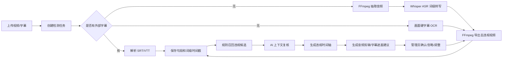
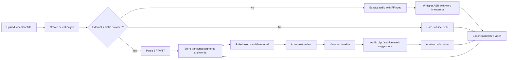

# AI 敏感词检测系统 / AI Sensitive Word Detection System

## 中文版

### 项目简介

AI 敏感词检测系统是一个基于 `Spring Boot + React` 的视频内容审核工作台。系统支持维护敏感词/违规词库，上传视频或字幕，通过 FFmpeg 抽取音频，使用本地 Whisper ASR 生成词级时间戳，也可对视频画面中的硬字幕做 OCR 识别，再通过规则召回和 AI 上下文复核判断是否违规，最终生成可确认、可调整、可导出的视频剪辑建议。

该项目的核心目标不是直接依赖“整段视频多模态审核”，而是构建一个可审计、可解释、可定位到时间轴的审核流程。

### 核心能力

- 违规词库维护：支持新增、编辑、删除、启停、CSV 导入。
- 多种匹配方式：精确词、变体词、正则词、语义规则。
- 视频上传：支持视频文件上传，可选上传 `.srt/.vtt` 字幕。
- 音频抽取：通过 FFmpeg 将视频音频转为 16kHz mono wav。
- Whisper ASR：通过本地 faster-whisper（CTranslate2，纯 CPU INT8）服务生成句段和词级时间戳。
- 画面字幕 OCR：无外部字幕时使用 RapidOCR（ONNXRuntime，模型随包内置）扫描视频画面硬字幕，将字幕文本作为独立检测层合并进时间轴。
- 简体中文输出：ASR 使用简体中文提示词，并用 OpenCC 做繁转简兜底。
- 规则召回：先用词库规则找到候选命中，降低 AI 审核成本。
- AI 复核：对接 OpenAI 兼容接口（Chat Completions 与 Responses 两种形态可配置切换），只复核候选上下文，输出违规判断、原因和置信度。
- 置信度把关：只有 AI 确认违规且置信度达到阈值（默认 0.6）的命中才进入违规时间轴并生成剪辑，低置信命中保留记录与原因但不自动剪，减少误剪。
- 时间轴展示：展示违规词出现的起止时间，并附 AI 置信度与判定原因。
- 剪辑/遮盖建议：基于词级时间戳，按命中词前后各留白 `app.clip.padding-seconds`（默认 0.2 秒）生成处理建议；音频命中走剪辑删除，画面字幕命中走 delogo 邻域插值修复（抹除字幕并尽量融入背景，而非盒式模糊）。
- 管理员确认：确认、忽略或手动调整剪辑片段。
- 视频导出：确认后调用 FFmpeg 导出去违规版本视频，字幕遮盖不会造成整段画面跳切。

### 技术栈

| 模块 | 技术 |
| --- | --- |
| 后端 | Spring Boot 3.3, Java 21, MyBatis-Plus, SQLite / MySQL |
| 前端 | React 18, TypeScript, Vite, Ant Design |
| ASR / OCR | FastAPI, faster-whisper (CTranslate2), RapidOCR (ONNXRuntime), OpenCV, OpenCC |
| 媒体处理 | FFmpeg, ffprobe |
| 数据库 | SQLite（默认，无需安装服务）/ MySQL 8+（可选） |

### 项目结构

```text
.
├── backend/      # Spring Boot 后端 API、检测管线、MyBatis-Plus Mapper
├── frontend/     # React + Vite 前端审核工作台
├── asr-service/  # FastAPI + faster-whisper 语音识别(CTranslate2, 纯 CPU)
├── ocr-service/  # FastAPI + RapidOCR 画面字幕识别(ONNXRuntime, 纯 CPU, 独立 venv)
└── README.md
```

### 检测流程



### 环境要求

- Java 21
- Maven 3.9+
- Node.js 18+
- SQLite（默认内置，无需单独安装）；可选 MySQL 8+
- Python 3.10
- FFmpeg / ffprobe

当前默认配置：

- 后端端口：`8090`
- 源码一键启动访问：`http://127.0.0.1:8090/`
- 前端开发端口：`5174`（仅手动 `npm run dev` 时使用）
- ASR 服务端口：`9000`
- OCR 服务端口：`9001`
- SQLite 数据库文件：一键启动为根目录 `video_moderation.db`，手动在 `backend` 目录启动时为 `backend/video_moderation.db`

### 数据库

后端默认使用 SQLite，并在启动时自动执行 `backend/src/main/resources/schema-sqlite.sql` 建表，不需要安装 MySQL。

默认配置位于 `backend/src/main/resources/application.yml`：

```yaml
spring:
  datasource:
    url: jdbc:sqlite:${user.dir}/video_moderation.db?foreign_keys=on&journal_mode=WAL&busy_timeout=5000
    driver-class-name: org.sqlite.JDBC
```

如需继续使用 MySQL，启动后端时启用 `mysql` profile：

```powershell
mvn "-Dspring-boot.run.profiles=mysql" spring-boot:run
```

MySQL 配置位于 `backend/src/main/resources/application-mysql.yml`，并使用 `schema-mysql.sql` 初始化。

### FFmpeg

后端默认读取：

```text
backend/tools/ffmpeg/bin/ffmpeg.exe
backend/tools/ffmpeg/bin/ffprobe.exe
```

该目录不会提交到 Git。你可以：

1. 将 Windows 版 FFmpeg 放到上述目录。
2. 或通过环境变量覆盖路径：

```powershell
$env:FFMPEG_PATH='D:\path\to\ffmpeg.exe'
$env:FFPROBE_PATH='D:\path\to\ffprobe.exe'
```

### 启动 ASR 服务

```powershell
cd asr-service
py -3.10 -m venv .venv
.\.venv\Scripts\python.exe -m pip install --upgrade pip
.\.venv\Scripts\pip.exe install -r requirements.txt

$env:WHISPER_MODEL='medium'
$env:WHISPER_DEVICE='cpu'
$env:WHISPER_FP16='false'
$env:WHISPER_LANGUAGE='zh'
$env:WHISPER_CHINESE_CONVERTER='t2s'
$env:WHISPER_INITIAL_PROMPT='请使用简体中文转写普通话内容。'
$env:PADDLE_OCR_LANG='ch'
$env:PADDLE_OCR_VERSION='PP-OCRv4'
$env:PADDLE_OCR_USE_GPU='false'
$env:PADDLE_OCR_ENABLE_MKLDNN='false'

.\.venv\Scripts\python.exe -m uvicorn app:app --host 127.0.0.1 --port 9000
```

说明：

- ASR 引擎是 faster-whisper（CTranslate2），首次识别会从 HuggingFace 下载 CT2 模型权重（缓存目录可用 `WHISPER_DOWNLOAD_ROOT` 指定，建议指向仓库 `.runtime\models`）。
- OCR 引擎是 RapidOCR（ONNXRuntime），PP-OCRv4 中英文模型随包内置、离线可用，无需下载；可用 `PADDLE_OCR_DET_MODEL` / `PADDLE_OCR_REC_MODEL` 指定自定义 onnx 模型路径。
- `WHISPER_MODEL` 可改为 `tiny/base/small/medium/large-v3` 等；默认 `medium`（配 INT8 量化，准确度与速度平衡），求快改 `small`，求更准改 `large-v3`。
- `WHISPER_COMPUTE_TYPE` 默认 `int8`（CPU 最快最省内存）；`WHISPER_CPU_THREADS` 建议设为物理性能核数（引擎默认 4 线程偏保守，开满全部核反而可能更慢）。
- 默认启用 beam search（`WHISPER_BEAM_SIZE=5`）提升数字/口语识别（如「几十块」不易被听成「十块」）；追求速度可设 `WHISPER_BEAM_SIZE=0` 改用贪心解码。
- 默认输出会使用简体中文提示词，并通过 OpenCC 做繁转简。
- 两个推理服务均为纯 CPU 轻量引擎，无 torch/paddle/CUDA 依赖，核显机器可直接运行。

### 启动后端

```powershell
cd backend
$env:JAVA_HOME='D:\Environment\jdk21'
$env:Path="$env:JAVA_HOME\bin;$env:Path"
mvn spring-boot:run
```

后端默认已开启 ASR：

```yaml
app:
  asr:
    enabled: true
    base-url: http://localhost:9000
```

如果你只想使用字幕文件检测，可以把 `app.asr.enabled` 改为 `false`。

画面字幕 OCR 默认开启，并复用 ASR 服务端口：

```yaml
app:
  subtitle-ocr:
    enabled: true
    ocr-path: /ocr-subtitles
    interval-seconds: 0.75
    crop-bottom-ratio: 0.35
    min-confidence: 0.35
```

说明：

- `crop-bottom-ratio` 表示从画面底部向上扫描的高度占比：`1.0` 扫描整个画面（识别任意位置文字，默认）；`0.35` 仅扫底部字幕条（更快，但会漏掉非底部的文字）。
- `interval-seconds` 越小越不容易漏字幕，但 OCR 更慢。
- OCR 结果会与音频 ASR 结果合并为两层；同一时间段口播和字幕文本相同也会保留两条来源，因为音频和字幕需要分别处理。
- 导出时，音频来源命中按现有方式删除对应时间片段；画面字幕来源命中走 ffmpeg delogo 邻域插值修复（抹除字幕并尽量融入背景，超宽字幕条自动横向分块，再做高斯柔化与边缘羽化），无法探测分辨率时回退盒式模糊。

### Windows 源码一键启动（推荐分发方式）

如果你是把源码发给别人本地使用，根目录只保留一个启动脚本：

```text
start-local.bat
```

环境准备好后直接双击 `start-local.bat`。首次缺少 Python venv、前端依赖或后端 Jar 时，它会在当前窗口中自动安装依赖并构建，然后隐藏启动 ASR、OCR、后端三个托管进程，并打开：

```text
http://127.0.0.1:8090/
```

启动后不会再弹出 ASR/OCR/后端的多个服务窗口；运行日志统一写入根目录 `logs/`，进程 PID 写入 `.runtime/`。

同一个脚本也支持少量维护命令：

```powershell
.\start-local.bat stop     # 停止由脚本托管的服务
.\start-local.bat status   # 查看服务状态
.\start-local.bat rebuild  # 强制重新构建前端与后端 Jar
```

开发调试用另一对脚本：双击 `dev.bat` 以开发模式源码直跑四个服务（backend/frontend/asr/ocr 日志带前缀汇聚在同一窗口，前端 :5174 热更新，Ctrl+C 一次全停）；`stop.bat` 按端口停止全部项目服务进程树（无论服务由哪种方式启动，含遗留孤儿进程）。

源码模式需要 Java 21、Maven 3.9+、Node.js、Python 3.10 与 FFmpeg。可以全局安装，也可以把轻量环境包解压到以下目录，脚本会优先使用本地环境：

```text
.runtime/jdk      # Java 21
.runtime/maven    # Maven
.runtime/node     # Node.js，目录内需有 npm.cmd
.runtime/python   # Python 3.10，目录内需有 python.exe
.runtime/ffmpeg   # FFmpeg，目录内需有 bin/ffmpeg.exe 与 bin/ffprobe.exe
```

环境下载地址：

| 环境 | 推荐下载地址 | 备注 |
| --- | --- | --- |
| Java 21 JDK | [Eclipse Temurin JDK 21 Windows x64](https://adoptium.net/temurin/releases/?version=21&os=windows&arch=x64&package=jdk) | 下载 JDK，不要下载 JRE；可安装到系统，也可放到 `.runtime/jdk` |
| Maven 3.9+ | [Apache Maven Download](https://maven.apache.org/download.cgi) | 下载 Binary zip archive，解压后目录内应有 `bin/mvn.cmd` |
| Node.js | [Node.js Downloads](https://nodejs.org/en/download) | 下载 Windows x64 安装包或 zip；放到 `.runtime/node` 时目录内应有 `npm.cmd` |
| Python 3.10.x | [Python 3.10.11 Release](https://www.python.org/downloads/release/python-31011/) / [Windows 64-bit installer](https://www.python.org/ftp/python/3.10.11/python-3.10.11-amd64.exe) | 使用正常安装版，需支持 `venv` 和 `pip`；不要用 embeddable package |
| FFmpeg | [FFmpeg Download](https://ffmpeg.org/download.html) / [gyan.dev Windows builds](https://www.gyan.dev/ffmpeg/builds/) | 下载 release essentials zip，解压后把 `bin/ffmpeg.exe` 和 `bin/ffprobe.exe` 放到 `.runtime/ffmpeg/bin` |

推理默认纯 CPU。需要改端口或模型配置时，编辑 `config/local.env`；如果文件不存在，脚本会从 `config/local.env.example` 自动复制一份。

关于“少装一个 Python 环境”：C# 项目看起来能直接执行 Python，通常是因为它把 Python 解释器和依赖一起内置了，或把 Python 代码打成 exe；底层仍然需要 Python runtime。当前项目的 ASR/OCR 依赖 faster-whisper、RapidOCR、OpenCV（纯 CPU 轻量依赖），推荐把 Python 3.10 放到 `.runtime/python`，让脚本首次启动时自动创建 ASR/OCR venv。这样最终用户不需要把 Python 安装到系统 PATH。不要使用 Python embeddable package，它默认不适合 `venv` 和 `pip`。

### 推理引擎与性能（纯 CPU）

两处本地推理均采用轻量纯 CPU 引擎，无 torch/paddle/CUDA 依赖，只有核显的机器可直接运行：

- **Whisper 语音识别**：faster-whisper（CTranslate2）INT8 量化，比 openai-whisper 纯 CPU 推理快约 4 倍、内存更省。提速优先级：`WHISPER_CPU_THREADS` 设为物理性能核数 > 换小模型（`small`）> `WHISPER_BEAM_SIZE=0` 贪心解码。
- **画面字幕 OCR**：RapidOCR（ONNXRuntime）+ 内置 PP-OCRv4 中英文模型，识别质量与 PP-OCR 同源；调大 `interval-seconds` 抽帧间隔可加快扫描。

两服务 `/health` 的 `gpu` 字段现为引擎自检信息（onnxruntime providers、ctranslate2 版本等），仅供排查。

常见问题：

- 编译 backend 报 `record` / text block 之类语法错误：用了 JDK8，请改用 Java 21（`set JAVA_HOME=...\jdk21`）后再 `mvn`。
- faster-whisper 首次下载模型失败：检查到 HuggingFace 的网络；若配置了 `HF_ENDPOINT` 镜像，注意部分镜像对部分模型会 308 跳回源站导致 huggingface_hub 报错，此时应去掉镜像配置改为直连或代理。

### AI 复核（OpenAI 兼容）

AI 复核与剪辑参数支持**前台即时配置**：在界面右上角点击齿轮图标打开「系统设置」，修改后对新建的检测任务立即生效，无需改文件或重启后端。设置持久化在数据库 `app_settings` 表（单行）。

`application.yml` 中的 `app.ai.*` / `app.clip.*` 仅作为**首次启动的初始默认值**（数据库无记录时种子化）：

```yaml
app:
  ai:
    enabled: false          # 改为 true 启用 AI 复核
    api-type: chat          # chat = /v1/chat/completions；responses = /v1/responses
    base-url: http://localhost:11434
    api-key:                # 需要鉴权时填入，作为 Authorization: Bearer
    model: qwen2.5
    temperature: 0          # 设为负数则不下发该参数（适配不支持自定义温度的推理模型）
    confidence-threshold: 0.6  # 置信度阈值：低于该值的命中不进入时间轴/剪辑
    timeout-seconds: 60
  clip:
    padding-seconds: 0.2    # 剪辑在命中词前后各留白的秒数，越小切得越少
    precise-export: false   # true 时导出重编码以帧级精确切割；false 为快速流复制
```

说明：

- 这些项均可在前台「系统设置」中调整；`application.yml` 改动只影响数据库尚无记录时的首次种子化。
- 两种形态都使用结构化输出（`json_schema`，字段 `violation/confidence/category/reason`），并对仅支持 `json_object` 的国产网关 / Ollama 做了兼容兜底。
- `api-type=chat` 兼容性最广（Ollama、vLLM、one-api、new-api 等）；`api-type=responses` 用于 OpenAI 新版 Responses 接口，请确认你的服务商支持该端点。
- 置信度把关：命中经 AI 复核后，仅当 `violation=true` 且 `confidence >= confidence-threshold` 才标记为违规；其余置为安全状态，仍可在「命中与 AI 复核」表中查看其置信度与原因。
- 关闭 AI 时，规则命中按 0.70 置信度全部保留为违规，便于人工兜底。
- 出于安全考虑，`GET /api/v1/settings` 不回传明文 API Key，仅返回 `aiApiKeyConfigured` 标记是否已配置；前台保存时留空即保持原 Key 不变。

### 前端开发模式

```powershell
cd frontend
npm install
npm run dev
```

仅调试前端时访问：

```text
http://127.0.0.1:5174/
```

普通本地使用请运行根目录 `start-local.bat`，由后端 Jar 直接提供前端页面，访问 `http://127.0.0.1:8090/`。

### REST API

| 方法 | 路径 | 说明 |
| --- | --- | --- |
| `POST` | `/api/v1/videos` | 上传视频，可选 `subtitle` |
| `GET` | `/api/v1/videos` | 视频列表 |
| `GET` | `/api/v1/videos/{id}` | 视频详情 |
| `GET` | `/api/v1/videos/{id}/content` | 视频内容预览 |
| `POST` | `/api/v1/videos/{id}/jobs` | 创建检测任务 |
| `GET` | `/api/v1/jobs/{id}` | 查询任务进度 |
| `GET` | `/api/v1/jobs/{id}/segments` | 字幕句段 |
| `GET` | `/api/v1/jobs/{id}/hits` | 违规命中 |
| `GET` | `/api/v1/jobs/{id}/timeline` | 违规时间轴 |
| `GET` | `/api/v1/jobs/{id}/clip-suggestions` | 剪辑建议 |
| `POST` | `/api/v1/jobs/{id}/clip-suggestions` | 重新生成剪辑建议 |
| `PATCH` | `/api/v1/clip-suggestions/{id}` | 确认、忽略或调整剪辑 |
| `POST` | `/api/v1/videos/{id}/exports` | 导出去违规视频 |
| `GET/POST/PATCH/DELETE` | `/api/v1/terms` | 维护违规词 |
| `POST` | `/api/v1/terms/import` | CSV 导入违规词 |
| `GET` | `/api/v1/settings` | 读取系统设置（AI/剪辑，屏蔽 API Key） |
| `PUT` | `/api/v1/settings` | 更新系统设置（前台即时生效） |

### 价格/金额这类模糊表达

价格、金额、报价等表达不适合穷举维护。可以新增一条语义规则：

- 词条：`价格` 或 `金额`
- 分类：`价格`
- 匹配方式：`语义`
- 严重级别：按业务要求选择

系统会召回 `1块钱`、`1块`、`29.9`、`¥29.9`、`一百元` 等候选表达，再交给 AI 根据上下文判断是否真的违规。

### CSV 导入格式

违规词 CSV 列顺序：

```text
term,category,severity,matchType,variants
```

示例：

```csv
价格,价格,HIGH,SEMANTIC,
违禁词,敏感内容,CRITICAL,EXACT,
```

### 注意事项

- 本项目不会提交本地视频、模型、虚拟环境、FFmpeg 二进制文件。
- ASR 模型由 faster-whisper 首次运行时从 HuggingFace 下载（可经 `WHISPER_DOWNLOAD_ROOT` 缓存到仓库内）；OCR 模型随 RapidOCR 包内置，无需下载。
- 真实生产环境建议增加鉴权、审计日志、对象存储、任务队列和模型服务监控。
- AI 复核只处理规则召回候选，不做全文无差别审核。

---

## English Version

### Overview

AI Sensitive Word Detection System is a video moderation console built with `Spring Boot + React`. It manages a sensitive-term dictionary, uploads videos or subtitle files, extracts audio with FFmpeg, transcribes speech with local Whisper ASR, can OCR hard subtitles shown in the video frame, maps terms to timestamps, reviews candidate hits with AI, and generates editable clip suggestions for administrators.

The system is designed for auditability and precise timeline positioning instead of relying on a black-box multimodal video model.

### Key Features

- Sensitive-term management: create, edit, delete, enable, disable, and CSV import.
- Matching modes: exact terms, variants, regex, and semantic rules.
- Video upload: upload video files with optional `.srt/.vtt` subtitles.
- Audio extraction: convert video audio to 16kHz mono wav using FFmpeg.
- Whisper ASR: generate segment-level and word-level timestamps via faster-whisper (CTranslate2, CPU INT8).
- Hard-subtitle OCR: scan on-screen subtitles with RapidOCR (ONNXRuntime, bundled models) and merge recognized text as an independent moderation layer.
- Simplified Chinese output: ASR uses a Simplified Chinese prompt and OpenCC fallback conversion.
- Rule recall: find candidate hits before AI review.
- AI review: call an OpenAI-compatible API (Chat Completions or Responses, switchable via `app.ai.api-type`) to review only candidate contexts and return violation, confidence, and reason.
- Confidence gating: only hits the AI confirms as violations with `confidence >= app.ai.confidence-threshold` (default 0.6) enter the timeline and produce clips; low-confidence hits are kept and explained but not auto-clipped.
- Timeline view: show where sensitive words appear, with AI confidence and reason.
- Clip / mask suggestions: based on word-level timestamps, padded by `app.clip.padding-seconds` (default 0.2s); audio hits remove the segment, while video-subtitle hits are erased via delogo inpainting (falling back to box blur when resolution probing fails).
- Admin confirmation: confirm, ignore, or adjust suggested clips.
- Export: generate moderated videos after confirmation without hard subtitle hits causing full-frame jump cuts.

### Tech Stack

| Layer | Stack |
| --- | --- |
| Backend | Spring Boot 3.3, Java 21, MyBatis-Plus, SQLite / MySQL |
| Frontend | React 18, TypeScript, Vite, Ant Design |
| ASR / OCR | FastAPI, faster-whisper (CTranslate2), RapidOCR (ONNXRuntime), OpenCV, OpenCC |
| Media | FFmpeg, ffprobe |
| Database | SQLite by default, optional MySQL 8+ |

### Project Structure

```text
.
├── backend/      # Spring Boot APIs, detection pipeline, MyBatis-Plus mappers
├── frontend/     # React + Vite moderation console
├── asr-service/  # FastAPI + faster-whisper speech recognition (CTranslate2, CPU-only)
├── ocr-service/  # FastAPI + RapidOCR hard-subtitle recognition (ONNXRuntime, CPU-only, separate venv)
└── README.md
```

### Detection Pipeline



### Requirements

- Java 21
- Maven 3.9+
- Node.js 18+
- SQLite by default, no separate database service required; optional MySQL 8+
- Python 3.10
- FFmpeg / ffprobe

Default services:

- Backend: `8090`
- One-click source startup: `http://127.0.0.1:8090/`
- Frontend dev server: `5174` (only for manual `npm run dev`)
- ASR: `9000`
- OCR: `9001`
- SQLite database file: root `video_moderation.db` for one-click startup, or `backend/video_moderation.db` when manually starting from the `backend` directory

### Database

The backend uses SQLite by default and automatically initializes tables from `backend/src/main/resources/schema-sqlite.sql`; no MySQL installation is required.

Default datasource:

```yaml
spring:
  datasource:
    url: jdbc:sqlite:${user.dir}/video_moderation.db?foreign_keys=on&journal_mode=WAL&busy_timeout=5000
    driver-class-name: org.sqlite.JDBC
```

To keep using MySQL, start the backend with the `mysql` profile:

```powershell
mvn "-Dspring-boot.run.profiles=mysql" spring-boot:run
```

MySQL settings live in `backend/src/main/resources/application-mysql.yml` and use `schema-mysql.sql`.

### FFmpeg

The backend defaults to:

```text
backend/tools/ffmpeg/bin/ffmpeg.exe
backend/tools/ffmpeg/bin/ffprobe.exe
```

This directory is not committed. You can either place FFmpeg there or override paths:

```powershell
$env:FFMPEG_PATH='D:\path\to\ffmpeg.exe'
$env:FFPROBE_PATH='D:\path\to\ffprobe.exe'
```

### Windows One-Click Source Startup

For source-code distribution, use the single root startup script:

```text
start-local.bat
```

Double-click `start-local.bat` to start. It runs missing setup work automatically, starts ASR, OCR, and backend as hidden managed processes, and opens `http://127.0.0.1:8090/`. Logs are written to `logs/`, and PID files to `.runtime/`.

The same script also supports:

```powershell
.\start-local.bat stop
.\start-local.bat status
.\start-local.bat rebuild
```

Install Java 21, Maven 3.9+, Node.js, Python 3.10, and FFmpeg globally, or unzip a lightweight environment bundle into `.runtime/jdk`, `.runtime/maven`, `.runtime/node`, `.runtime/python`, and `.runtime/ffmpeg`; local runtime directories are preferred over global tools.

### Start ASR

```powershell
cd asr-service
py -3.10 -m venv .venv
.\.venv\Scripts\python.exe -m pip install --upgrade pip
.\.venv\Scripts\pip.exe install -r requirements.txt

$env:WHISPER_MODEL='medium'
$env:WHISPER_DEVICE='cpu'
$env:WHISPER_FP16='false'
$env:WHISPER_LANGUAGE='zh'
$env:WHISPER_CHINESE_CONVERTER='t2s'
$env:WHISPER_INITIAL_PROMPT='请使用简体中文转写普通话内容。'
$env:PADDLE_OCR_LANG='ch'
$env:PADDLE_OCR_VERSION='PP-OCRv4'
$env:PADDLE_OCR_USE_GPU='false'
$env:PADDLE_OCR_ENABLE_MKLDNN='false'

.\.venv\Scripts\python.exe -m uvicorn app:app --host 127.0.0.1 --port 9000
```

Notes:

- The ASR engine is faster-whisper (CTranslate2); CT2 model weights are downloaded from HuggingFace on first use (set `WHISPER_DOWNLOAD_ROOT` to keep the cache inside the repo).
- The OCR engine is RapidOCR (ONNXRuntime); PP-OCRv4 models ship inside the wheel and work offline. Set `PADDLE_OCR_DET_MODEL` / `PADDLE_OCR_REC_MODEL` to point to custom onnx models.
- `WHISPER_MODEL` can be `tiny`, `base`, `small`, `medium`, or `large-v3`; the default is `medium` with `WHISPER_COMPUTE_TYPE=int8`.
- Set `WHISPER_CPU_THREADS` to your physical performance-core count for the best speed (the engine default of 4 threads is conservative; using every core can be slower).
- Simplified Chinese is enforced with both prompt guidance and OpenCC fallback conversion.
- Both inference services are lightweight CPU-only (no torch/paddle/CUDA); machines with integrated graphics run them as-is.

### Start Backend

```powershell
cd backend
$env:JAVA_HOME='D:\Environment\jdk21'
$env:Path="$env:JAVA_HOME\bin;$env:Path"
mvn spring-boot:run
```

ASR is enabled by default:

```yaml
app:
  asr:
    enabled: true
    base-url: http://localhost:9000
```

If you only want subtitle-based detection, set `app.asr.enabled` to `false`.

Hard-subtitle OCR is enabled by default and uses the same recognition service:

```yaml
app:
  subtitle-ocr:
    enabled: true
    ocr-path: /ocr-subtitles
    interval-seconds: 0.75
    crop-bottom-ratio: 0.35
    min-confidence: 0.35
```

### Frontend Development Mode

```powershell
cd frontend
npm install
npm run dev
```

Open this only when debugging the frontend dev server:

```text
http://127.0.0.1:5174/
```

For normal local usage, run `start-local.bat` from the repository root and open `http://127.0.0.1:8090/`; the backend jar serves the built frontend.

### REST API

| Method | Path | Description |
| --- | --- | --- |
| `POST` | `/api/v1/videos` | Upload video with optional `subtitle` |
| `GET` | `/api/v1/videos` | List videos |
| `GET` | `/api/v1/videos/{id}` | Get video details |
| `GET` | `/api/v1/videos/{id}/content` | Preview video content |
| `POST` | `/api/v1/videos/{id}/jobs` | Create detection job |
| `GET` | `/api/v1/jobs/{id}` | Query job progress |
| `GET` | `/api/v1/jobs/{id}/segments` | Transcript segments |
| `GET` | `/api/v1/jobs/{id}/hits` | Sensitive-term hits |
| `GET` | `/api/v1/jobs/{id}/timeline` | Violation timeline |
| `GET` | `/api/v1/jobs/{id}/clip-suggestions` | Clip suggestions |
| `POST` | `/api/v1/jobs/{id}/clip-suggestions` | Regenerate clip suggestions |
| `PATCH` | `/api/v1/clip-suggestions/{id}` | Confirm, ignore, or adjust clip |
| `POST` | `/api/v1/videos/{id}/exports` | Export moderated video |
| `GET/POST/PATCH/DELETE` | `/api/v1/terms` | Manage sensitive terms |
| `POST` | `/api/v1/terms/import` | Import terms from CSV |
| `GET` | `/api/v1/settings` | Read system settings (AI/clip, API key masked) |
| `PUT` | `/api/v1/settings` | Update system settings (effective immediately) |

### Semantic Price Rules

Price, amount, and quote expressions are difficult to maintain as a fixed dictionary. You can create a semantic rule:

- Term: `价格` or `金额`
- Category: `价格`
- Match type: `语义`
- Severity: choose according to policy

The system recalls candidates such as `1块钱`, `1块`, `29.9`, `¥29.9`, and `一百元`, then asks AI to review the context.

### CSV Import Format

Columns:

```text
term,category,severity,matchType,variants
```

Example:

```csv
价格,价格,HIGH,SEMANTIC,
SensitiveTerm,Sensitive Content,CRITICAL,EXACT,
```

### Notes

- Local videos, model files, virtual environments, and FFmpeg binaries are not committed.
- Whisper models are downloaded and cached locally on first use.
- Production deployments should add authentication, audit logs, object storage, a job queue, and model service monitoring.
- AI review only checks rule-recalled candidates instead of reviewing every sentence blindly.
