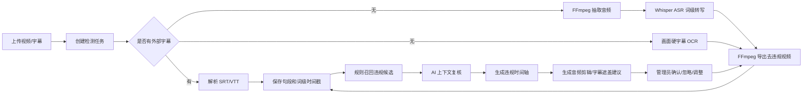
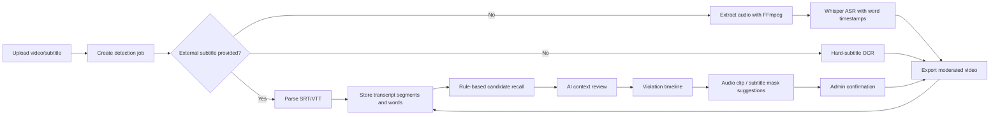

# AI 敏感词检测系统 / AI Sensitive Word Detection System

## 中文版

### 项目简介

AI 敏感词检测系统是一个基于 `Spring Boot + React` 的视频内容审核工作台。系统支持维护敏感词/违规词库，上传视频或字幕，通过 FFmpeg 抽取音频，使用本地 Whisper ASR 生成词级时间戳，也可对视频画面中的硬字幕做 OCR 识别，再通过规则召回和 AI 上下文复核判断是否违规，最终生成可确认、可调整、可导出的视频剪辑建议。

该项目的核心目标不是直接依赖“整段视频多模态审核”，而是构建一个可审计、可解释、可定位到时间轴的审核流程。

### 核心能力

- 违规词库维护：支持新增、编辑、删除、启停、CSV 导入。
- 多种匹配方式：精确词、变体词、正则词、语义规则。
- 视频上传：支持视频文件上传，可选上传 `.srt/.vtt` 字幕。
- 音频抽取：通过 FFmpeg 将视频音频转为 16kHz mono wav。
- Whisper ASR：通过本地 `openai/whisper` 服务生成句段和词级时间戳。
- 画面字幕 OCR：无外部字幕时使用 PaddleOCR 扫描视频底部硬字幕，将字幕文本作为独立检测层合并进时间轴。
- 简体中文输出：ASR 使用简体中文提示词，并用 OpenCC 做繁转简兜底。
- 规则召回：先用词库规则找到候选命中，降低 AI 审核成本。
- AI 复核：对接 OpenAI 兼容接口（Chat Completions 与 Responses 两种形态可配置切换），只复核候选上下文，输出违规判断、原因和置信度。
- 置信度把关：只有 AI 确认违规且置信度达到阈值（默认 0.6）的命中才进入违规时间轴并生成剪辑，低置信命中保留记录与原因但不自动剪，减少误剪。
- 时间轴展示：展示违规词出现的起止时间，并附 AI 置信度与判定原因。
- 剪辑/遮盖建议：基于词级时间戳，按命中词前后各留白 `app.clip.padding-seconds`（默认 0.2 秒）生成处理建议；音频命中走剪辑删除，画面字幕命中走 delogo 邻域插值修复（抹除字幕并尽量融入背景，而非盒式模糊）。
- 管理员确认：确认、忽略或手动调整剪辑片段。
- 视频导出：确认后调用 FFmpeg 导出去违规版本视频，字幕遮盖不会造成整段画面跳切。

### 技术栈

| 模块 | 技术 |
| --- | --- |
| 后端 | Spring Boot 3.3, Java 21, MyBatis-Plus, SQLite / MySQL |
| 前端 | React 18, TypeScript, Vite, Ant Design |
| ASR / OCR | FastAPI, openai-whisper, PaddleOCR, OpenCV, OpenCC |
| 媒体处理 | FFmpeg, ffprobe |
| 数据库 | SQLite（默认，无需安装服务）/ MySQL 8+（可选） |

### 项目结构

```text
.
├── backend/      # Spring Boot 后端 API、检测管线、MyBatis-Plus Mapper
├── frontend/     # React + Vite 前端审核工作台
├── asr-service/  # FastAPI + openai/whisper 语音识别(GPU: install-gpu.bat 装 torch cu130)
├── ocr-service/  # FastAPI + PaddleOCR 画面字幕识别(GPU: install-ocr-gpu.bat, 独立 venv 不含 torch)
└── README.md
```

### 检测流程



### 环境要求

- Java 21
- Maven 3.9+
- Node.js 18+
- SQLite（默认内置，无需单独安装）；可选 MySQL 8+
- Python 3.10
- FFmpeg / ffprobe

当前默认配置：

- 后端端口：`8090`
- 源码一键启动访问：`http://127.0.0.1:8090/`
- 前端开发端口：`5174`（仅手动 `npm run dev` 时使用）
- ASR 服务端口：`9000`
- OCR 服务端口：`9001`
- SQLite 数据库文件：一键启动为根目录 `video_moderation.db`，手动在 `backend` 目录启动时为 `backend/video_moderation.db`

### 数据库

后端默认使用 SQLite，并在启动时自动执行 `backend/src/main/resources/schema-sqlite.sql` 建表，不需要安装 MySQL。

默认配置位于 `backend/src/main/resources/application.yml`：

```yaml
spring:
  datasource:
    url: jdbc:sqlite:${user.dir}/video_moderation.db?foreign_keys=on&journal_mode=WAL&busy_timeout=5000
    driver-class-name: org.sqlite.JDBC
```

如需继续使用 MySQL，启动后端时启用 `mysql` profile：

```powershell
mvn "-Dspring-boot.run.profiles=mysql" spring-boot:run
```

MySQL 配置位于 `backend/src/main/resources/application-mysql.yml`，并使用 `schema-mysql.sql` 初始化。

### FFmpeg

后端默认读取：

```text
backend/tools/ffmpeg/bin/ffmpeg.exe
backend/tools/ffmpeg/bin/ffprobe.exe
```

该目录不会提交到 Git。你可以：

1. 将 Windows 版 FFmpeg 放到上述目录。
2. 或通过环境变量覆盖路径：

```powershell
$env:FFMPEG_PATH='D:\path\to\ffmpeg.exe'
$env:FFPROBE_PATH='D:\path\to\ffprobe.exe'
```

### 启动 ASR 服务

```powershell
cd asr-service
py -3.10 -m venv .venv
.\.venv\Scripts\python.exe -m pip install --upgrade pip
.\.venv\Scripts\pip.exe install -r requirements.txt

$env:WHISPER_MODEL='large-v3'
$env:WHISPER_DEVICE='cpu'
$env:WHISPER_FP16='false'
$env:WHISPER_LANGUAGE='zh'
$env:WHISPER_CHINESE_CONVERTER='t2s'
$env:WHISPER_INITIAL_PROMPT='请使用简体中文转写普通话内容。'
$env:PADDLE_OCR_LANG='ch'
$env:PADDLE_OCR_VERSION='PP-OCRv4'
$env:PADDLE_OCR_USE_GPU='false'
$env:PADDLE_OCR_ENABLE_MKLDNN='false'

.\.venv\Scripts\python.exe -m uvicorn app:app --host 127.0.0.1 --port 9000
```

说明：

- 第一次识别会下载 Whisper 模型。
- 第一次画面字幕 OCR 会下载 PaddleOCR 模型。
- 默认使用 PaddleOCR `PP-OCRv4` 移动版模型，适合本地 CPU；需要指定模型时可设置 `PADDLE_OCR_DET_MODEL` / `PADDLE_OCR_REC_MODEL`。
- CPU 默认禁用 PaddleOCR 的 MKLDNN/oneDNN 加速，避免部分 PaddlePaddle 版本在 PP-OCRv4 推理时报 `ConvertPirAttribute2RuntimeAttribute`；确认本机版本兼容后可把 `PADDLE_OCR_ENABLE_MKLDNN` 改为 `true`。
- `WHISPER_MODEL` 可改为 `tiny/base/small/medium/large/large-v3/turbo`。
- 当前默认使用 `large-v3`；CPU 环境会更慢，如只验证流程可临时改为 `base` 或 `small`。
- CPU 环境保持 `WHISPER_FP16=false`；使用 CUDA 时可按硬件情况改为 `true`。
- 默认启用 beam search（`WHISPER_BEAM_SIZE=5`）提升数字/口语识别（如「几十块」不易被听成「十块」）；CPU 上更慢，可设 `WHISPER_BEAM_SIZE=0` 改用更快的贪心解码。
- 默认输出会使用简体中文提示词，并通过 OpenCC 做繁转简。
- **NVIDIA GPU 加速**：以上为 CPU 默认配置；有 NVIDIA 显卡时见下方「GPU 加速」章节一键切到 CUDA（含 RTX 50 系 Blackwell）。

### 启动后端

```powershell
cd backend
$env:JAVA_HOME='D:\Environment\jdk21'
$env:Path="$env:JAVA_HOME\bin;$env:Path"
mvn spring-boot:run
```

后端默认已开启 ASR：

```yaml
app:
  asr:
    enabled: true
    base-url: http://localhost:9000
```

如果你只想使用字幕文件检测，可以把 `app.asr.enabled` 改为 `false`。

画面字幕 OCR 默认开启，并复用 ASR 服务端口：

```yaml
app:
  subtitle-ocr:
    enabled: true
    ocr-path: /ocr-subtitles
    interval-seconds: 0.75
    crop-bottom-ratio: 0.35
    min-confidence: 0.35
```

说明：

- `crop-bottom-ratio` 表示从画面底部向上扫描的高度占比：`1.0` 扫描整个画面（识别任意位置文字，默认）；`0.35` 仅扫底部字幕条（更快，但会漏掉非底部的文字）。
- `interval-seconds` 越小越不容易漏字幕，但 OCR 更慢。
- OCR 结果会与音频 ASR 结果合并为两层；同一时间段口播和字幕文本相同也会保留两条来源，因为音频和字幕需要分别处理。
- 导出时，音频来源命中按现有方式删除对应时间片段；画面字幕来源命中走 ffmpeg delogo 邻域插值修复（抹除字幕并尽量融入背景，超宽字幕条自动横向分块，再做高斯柔化与边缘羽化），无法探测分辨率时回退盒式模糊。

### Windows 源码一键启动（推荐分发方式）

如果你是把源码发给别人本地使用，根目录已提供单窗口启动脚本：

```text
start-local.bat   # 启动；首次缺少依赖/构建产物时会自动执行 setup
setup-local.bat   # 手动执行首次环境准备
stop-local.bat    # 停止后台托管进程
status-local.bat  # 查看进程与 HTTP 健康状态
```

首次启动可以直接双击 `start-local.bat`。它会在当前窗口中完成依赖安装与构建，然后隐藏启动 ASR、OCR、后端三个托管进程，并打开：

```text
http://127.0.0.1:8090/
```

启动后不会再弹出 ASR/OCR/后端的多个服务窗口；运行日志统一写入根目录 `logs/`，进程 PID 写入 `.runtime/`。停止时双击 `stop-local.bat`。

源码模式需要 Java 21、Maven 3.9+、Node.js、Python 3.10 与 FFmpeg。可以全局安装，也可以把轻量环境包解压到以下目录，脚本会优先使用本地环境：

```text
.runtime/jdk      # Java 21
.runtime/maven    # Maven
.runtime/node     # Node.js，目录内需有 npm.cmd
.runtime/python   # Python 3.10，目录内需有 python.exe
.runtime/ffmpeg   # FFmpeg，目录内需有 bin/ffmpeg.exe 与 bin/ffprobe.exe
```

默认按 CPU 模式启动。需要改端口、GPU 或模型配置时，编辑 `config/local.env`；如果文件不存在，脚本会从 `config/local.env.example` 自动复制一份。

### Windows 一键本地部署包

如果不想让使用者安装 Maven/Node/Python，也可以由开发者提前生成 Windows 解压包。生成包会把前端静态资源打进后端 Jar，并复制 ASR/OCR 服务、可选 Python `.venv`、FFmpeg 与 `start.bat` / `stop.bat` / `status.bat`。

```powershell
.\packaging\windows\build-local-package.ps1 -JdkHome D:\Environment\jdk21
```

如果要发给另一台机器直接解压使用，建议同时打包 JDK 与 Python 运行时：

```powershell
.\packaging\windows\build-local-package.ps1 `
  -JdkHome D:\Environment\jdk21 `
  -IncludeJdk:$true `
  -IncludePythonRuntime:$true
```

快速验证打包结构但不复制大型 Python 虚拟环境、不压缩：

```powershell
.\packaging\windows\build-local-package.ps1 -JdkHome D:\Environment\jdk21 -IncludePythonVenv:$false -NoZip
```

生成目录默认在 `release\AI-sensitive-word-detection-system-local`，最终用户解压后双击 `start.bat`，访问 `http://127.0.0.1:8090/`。更多说明见 `packaging/windows/README.md`。

### GPU 加速（NVIDIA 显卡 / RTX 50 系 Blackwell sm_120）

两处本地推理（Whisper 语音识别、PaddleOCR 画面字幕）默认跑在 CPU。有 NVIDIA 显卡时可切到 GPU 大幅提速。核心动作是把深度学习框架换成**包含对应 GPU 计算核（kernel）的 CUDA 构建**——旧版本在新显卡上会报 `no kernel image is available for execution on the device`。

> RTX 50 系（Blackwell，计算能力 sm_120）需要较新的框架：PyTorch 走 CUDA 13.0（cu130）构建，PaddlePaddle 走 CUDA 12.9（cu129）构建。下面命令以此为准；更早的显卡可改用对应的 cu121/cu124 等构建。

> **重要架构说明**：torch（Whisper, CUDA 13）与 paddlepaddle-gpu（OCR, CUDA 12）共用同名 `cudnn64_9.dll`，**无法在同一进程共存**（报 `WinError 127`），且 paddleocr 在检测到 torch 时会拉起它。因此 Whisper 与 OCR 用**两个独立 venv、两个进程**：asr venv 装 torch（GPU）跑 Whisper（9000）；OCR 用独立目录 ocr-service 的专用 venv（装 paddle GPU + paddleocr、**不装 torch**，paddleocr 自动降级为纯 paddle）跑 `ocr_app.py`（9001）。

#### 1. 安装两个 GPU 环境

**Whisper（asr-service/.venv，torch cu130）**：

```powershell
cd asr-service
.\install-gpu.bat
```

**OCR（ocr-service/.venv，paddle GPU + paddleocr，不含 torch）**：

```powershell
cd ocr-service
.\install-ocr-gpu.bat
```

`install-ocr-gpu.bat` 会新建 `.venv` 并装 `paddlepaddle-gpu==3.2.1`(cu129) + `nvidia-cuda-nvrtc-cu12`(cuDNN 运行时编译所需) + `paddleocr` + 服务依赖；它**不装 torch**——这是 OCR 能用 GPU 的关键（有 torch 会和 paddle 的 cuDNN 冲突）。脚本结尾会校验该 venv 里确实没有 torch。

#### 2. 启动（GPU 模式）

编辑根目录 `config/local.env`，把本地推理切到 GPU：

```env
WHISPER_DEVICE=cuda
WHISPER_FP16=true
PADDLE_OCR_USE_GPU=true
```

然后使用同一个单窗口启动入口：

```powershell
.\start-local.bat
```

脚本会隐藏启动 ASR(9000) / OCR(9001) / Backend(8090) 三个托管进程，并打开 `http://127.0.0.1:8090/`。如果需要确认 GPU 是否生效，访问 ASR/OCR 的 `/health` 或运行 `status-local.bat` 后查看服务状态与日志。

验证 GPU 是否真正生效：
- Whisper：`http://127.0.0.1:9000/health` → `gpu.torchCudaAvailable=true`、`gpu.torchHasSm120=true`。
- OCR：`http://127.0.0.1:9001/health` → `gpu.paddleCompiledWithCuda=true`。

后端 `application.yml` 的 `app.subtitle-ocr.base-url` 已指向 `http://localhost:9001`（独立 OCR 服务）。

> 说明：PaddleOCR 升级到 3.x 后，旧的 `use_gpu` / `show_log` / `enable_mkldnn` / `use_angle_cls` 参数已移除或更名，GPU 改由 `device='gpu'` 控制（后端按 `PADDLE_OCR_USE_GPU` 自动注入）；`PADDLE_OCR_VERSION` 默认 `PP-OCRv4`，需要时可设为空或 `PP-OCRv5`。

#### 3. 显存说明（8GB 卡重要）

- Whisper `large-v3`（FP16）推理峰值约 5–8GB，随音频时长与 `WHISPER_BEAM_SIZE` 变化。8GB 卡偏紧，若 OOM：把 `WHISPER_BEAM_SIZE` 调小，或把 `WHISPER_MODEL` 换成 `large-v3-turbo`（质量接近、显存友好）。
- Whisper 与 OCR 是两个进程、各自占显存，单任务的音频腿与画面腿并发时会叠加。8GB 卡若吃紧，可让 OCR 服务设 `PADDLE_OCR_USE_GPU=false` 回 CPU，把显存让给 Whisper。

#### 4. GPU 故障排查

- `no kernel image is available`：装了不含当前显卡计算核的旧框架，重跑 `install-gpu.bat`（RTX 50 系务必用 cu130 / cu129 构建，不要用 PyPI 默认的 `paddlepaddle-gpu`，那是旧 cu102 构建，不含 sm_120）。
- OCR 报 `cudnn_cnn64_9.dll ... WinError 127`：多半是 OCR 和 Whisper 跑在了同一进程。确认 OCR 用独立的 `ocr_app.py`（端口 9001）启动、且未在该进程引入 torch，`application.yml` 的 `app.subtitle-ocr.base-url` 指向 9001。
- 配了 `WHISPER_DEVICE=cuda` 却仍很慢/报错：多半装的是 CPU 版 torch（版本号带 `+cpu`）。`/health` 的 `gpu.torchCudaAvailable` 会显示 `false`；按上面重装。
- `paddleocr` 升级后把 `numpy` 顶到 2.x 导致 whisper/numba 报错：`.\.venv\Scripts\python.exe -m pip install numpy==1.26.4` 钉回。
- 编译 backend 报 `record` / text block 之类语法错误：用了 JDK8，请改用 Java 21（`set JAVA_HOME=...\jdk21`）后再 `mvn`。

### AI 复核（OpenAI 兼容）

AI 复核与剪辑参数支持**前台即时配置**：在界面右上角点击齿轮图标打开「系统设置」，修改后对新建的检测任务立即生效，无需改文件或重启后端。设置持久化在数据库 `app_settings` 表（单行）。

`application.yml` 中的 `app.ai.*` / `app.clip.*` 仅作为**首次启动的初始默认值**（数据库无记录时种子化）：

```yaml
app:
  ai:
    enabled: false          # 改为 true 启用 AI 复核
    api-type: chat          # chat = /v1/chat/completions；responses = /v1/responses
    base-url: http://localhost:11434
    api-key:                # 需要鉴权时填入，作为 Authorization: Bearer
    model: qwen2.5
    temperature: 0          # 设为负数则不下发该参数（适配不支持自定义温度的推理模型）
    confidence-threshold: 0.6  # 置信度阈值：低于该值的命中不进入时间轴/剪辑
    timeout-seconds: 60
  clip:
    padding-seconds: 0.2    # 剪辑在命中词前后各留白的秒数，越小切得越少
    precise-export: false   # true 时导出重编码以帧级精确切割；false 为快速流复制
```

说明：

- 这些项均可在前台「系统设置」中调整；`application.yml` 改动只影响数据库尚无记录时的首次种子化。
- 两种形态都使用结构化输出（`json_schema`，字段 `violation/confidence/category/reason`），并对仅支持 `json_object` 的国产网关 / Ollama 做了兼容兜底。
- `api-type=chat` 兼容性最广（Ollama、vLLM、one-api、new-api 等）；`api-type=responses` 用于 OpenAI 新版 Responses 接口，请确认你的服务商支持该端点。
- 置信度把关：命中经 AI 复核后，仅当 `violation=true` 且 `confidence >= confidence-threshold` 才标记为违规；其余置为安全状态，仍可在「命中与 AI 复核」表中查看其置信度与原因。
- 关闭 AI 时，规则命中按 0.70 置信度全部保留为违规，便于人工兜底。
- 出于安全考虑，`GET /api/v1/settings` 不回传明文 API Key，仅返回 `aiApiKeyConfigured` 标记是否已配置；前台保存时留空即保持原 Key 不变。

### 前端开发模式

```powershell
cd frontend
npm install
npm run dev
```

仅调试前端时访问：

```text
http://127.0.0.1:5174/
```

普通本地使用请运行根目录 `start-local.bat`，由后端 Jar 直接提供前端页面，访问 `http://127.0.0.1:8090/`。

### REST API

| 方法 | 路径 | 说明 |
| --- | --- | --- |
| `POST` | `/api/v1/videos` | 上传视频，可选 `subtitle` |
| `GET` | `/api/v1/videos` | 视频列表 |
| `GET` | `/api/v1/videos/{id}` | 视频详情 |
| `GET` | `/api/v1/videos/{id}/content` | 视频内容预览 |
| `POST` | `/api/v1/videos/{id}/jobs` | 创建检测任务 |
| `GET` | `/api/v1/jobs/{id}` | 查询任务进度 |
| `GET` | `/api/v1/jobs/{id}/segments` | 字幕句段 |
| `GET` | `/api/v1/jobs/{id}/hits` | 违规命中 |
| `GET` | `/api/v1/jobs/{id}/timeline` | 违规时间轴 |
| `GET` | `/api/v1/jobs/{id}/clip-suggestions` | 剪辑建议 |
| `POST` | `/api/v1/jobs/{id}/clip-suggestions` | 重新生成剪辑建议 |
| `PATCH` | `/api/v1/clip-suggestions/{id}` | 确认、忽略或调整剪辑 |
| `POST` | `/api/v1/videos/{id}/exports` | 导出去违规视频 |
| `GET/POST/PATCH/DELETE` | `/api/v1/terms` | 维护违规词 |
| `POST` | `/api/v1/terms/import` | CSV 导入违规词 |
| `GET` | `/api/v1/settings` | 读取系统设置（AI/剪辑，屏蔽 API Key） |
| `PUT` | `/api/v1/settings` | 更新系统设置（前台即时生效） |

### 价格/金额这类模糊表达

价格、金额、报价等表达不适合穷举维护。可以新增一条语义规则：

- 词条：`价格` 或 `金额`
- 分类：`价格`
- 匹配方式：`语义`
- 严重级别：按业务要求选择

系统会召回 `1块钱`、`1块`、`29.9`、`¥29.9`、`一百元` 等候选表达，再交给 AI 根据上下文判断是否真的违规。

### CSV 导入格式

违规词 CSV 列顺序：

```text
term,category,severity,matchType,variants
```

示例：

```csv
价格,价格,HIGH,SEMANTIC,
违禁词,敏感内容,CRITICAL,EXACT,
```

### 注意事项

- 本项目不会提交本地视频、模型、虚拟环境、FFmpeg 二进制文件。
- ASR 模型由 openai-whisper 首次运行时下载并缓存到本机；OCR 模型由 PaddleOCR 首次运行时下载并缓存。
- 真实生产环境建议增加鉴权、审计日志、对象存储、任务队列和模型服务监控。
- AI 复核只处理规则召回候选，不做全文无差别审核。

---

## English Version

### Overview

AI Sensitive Word Detection System is a video moderation console built with `Spring Boot + React`. It manages a sensitive-term dictionary, uploads videos or subtitle files, extracts audio with FFmpeg, transcribes speech with local Whisper ASR, can OCR hard subtitles shown in the video frame, maps terms to timestamps, reviews candidate hits with AI, and generates editable clip suggestions for administrators.

The system is designed for auditability and precise timeline positioning instead of relying on a black-box multimodal video model.

### Key Features

- Sensitive-term management: create, edit, delete, enable, disable, and CSV import.
- Matching modes: exact terms, variants, regex, and semantic rules.
- Video upload: upload video files with optional `.srt/.vtt` subtitles.
- Audio extraction: convert video audio to 16kHz mono wav using FFmpeg.
- Whisper ASR: generate segment-level and word-level timestamps.
- Hard-subtitle OCR: scan bottom-screen subtitles with PaddleOCR and merge recognized text as an independent moderation layer.
- Simplified Chinese output: ASR uses a Simplified Chinese prompt and OpenCC fallback conversion.
- Rule recall: find candidate hits before AI review.
- AI review: call an OpenAI-compatible API (Chat Completions or Responses, switchable via `app.ai.api-type`) to review only candidate contexts and return violation, confidence, and reason.
- Confidence gating: only hits the AI confirms as violations with `confidence >= app.ai.confidence-threshold` (default 0.6) enter the timeline and produce clips; low-confidence hits are kept and explained but not auto-clipped.
- Timeline view: show where sensitive words appear, with AI confidence and reason.
- Clip / mask suggestions: based on word-level timestamps, padded by `app.clip.padding-seconds` (default 0.2s); audio hits remove the segment, while video-subtitle hits are erased via delogo inpainting (falling back to box blur when resolution probing fails).
- Admin confirmation: confirm, ignore, or adjust suggested clips.
- Export: generate moderated videos after confirmation without hard subtitle hits causing full-frame jump cuts.

### Tech Stack

| Layer | Stack |
| --- | --- |
| Backend | Spring Boot 3.3, Java 21, MyBatis-Plus, SQLite / MySQL |
| Frontend | React 18, TypeScript, Vite, Ant Design |
| ASR / OCR | FastAPI, openai-whisper, PaddleOCR, OpenCV, OpenCC |
| Media | FFmpeg, ffprobe |
| Database | SQLite by default, optional MySQL 8+ |

### Project Structure

```text
.
├── backend/      # Spring Boot APIs, detection pipeline, MyBatis-Plus mappers
├── frontend/     # React + Vite moderation console
├── asr-service/  # FastAPI + openai/whisper speech recognition (GPU: install-gpu.bat, torch cu130)
├── ocr-service/  # FastAPI + PaddleOCR hard-subtitle recognition (GPU: install-ocr-gpu.bat, separate venv, no torch)
└── README.md
```

### Detection Pipeline



### Requirements

- Java 21
- Maven 3.9+
- Node.js 18+
- SQLite by default, no separate database service required; optional MySQL 8+
- Python 3.10
- FFmpeg / ffprobe

Default services:

- Backend: `8090`
- One-click source startup: `http://127.0.0.1:8090/`
- Frontend dev server: `5174` (only for manual `npm run dev`)
- ASR: `9000`
- OCR: `9001`
- SQLite database file: root `video_moderation.db` for one-click startup, or `backend/video_moderation.db` when manually starting from the `backend` directory

### Database

The backend uses SQLite by default and automatically initializes tables from `backend/src/main/resources/schema-sqlite.sql`; no MySQL installation is required.

Default datasource:

```yaml
spring:
  datasource:
    url: jdbc:sqlite:${user.dir}/video_moderation.db?foreign_keys=on&journal_mode=WAL&busy_timeout=5000
    driver-class-name: org.sqlite.JDBC
```

To keep using MySQL, start the backend with the `mysql` profile:

```powershell
mvn "-Dspring-boot.run.profiles=mysql" spring-boot:run
```

MySQL settings live in `backend/src/main/resources/application-mysql.yml` and use `schema-mysql.sql`.

### FFmpeg

The backend defaults to:

```text
backend/tools/ffmpeg/bin/ffmpeg.exe
backend/tools/ffmpeg/bin/ffprobe.exe
```

This directory is not committed. You can either place FFmpeg there or override paths:

```powershell
$env:FFMPEG_PATH='D:\path\to\ffmpeg.exe'
$env:FFPROBE_PATH='D:\path\to\ffprobe.exe'
```

### Windows One-Click Source Startup

For source-code distribution, use the root scripts:

```text
start-local.bat   # start; runs setup automatically on first use
setup-local.bat   # prepare dependencies and build the backend jar
stop-local.bat    # stop managed background processes
status-local.bat  # print process and HTTP status
```

The scripts start ASR, OCR, and backend as hidden managed processes, so no extra service windows are opened. Logs are written to `logs/`, PID files to `.runtime/`, and the browser opens `http://127.0.0.1:8090/`.

Install Java 21, Maven 3.9+, Node.js, Python 3.10, and FFmpeg globally, or unzip a lightweight environment bundle into `.runtime/jdk`, `.runtime/maven`, `.runtime/node`, `.runtime/python`, and `.runtime/ffmpeg`; local runtime directories are preferred over global tools.

### Start ASR

```powershell
cd asr-service
py -3.10 -m venv .venv
.\.venv\Scripts\python.exe -m pip install --upgrade pip
.\.venv\Scripts\pip.exe install -r requirements.txt

$env:WHISPER_MODEL='large-v3'
$env:WHISPER_DEVICE='cpu'
$env:WHISPER_FP16='false'
$env:WHISPER_LANGUAGE='zh'
$env:WHISPER_CHINESE_CONVERTER='t2s'
$env:WHISPER_INITIAL_PROMPT='请使用简体中文转写普通话内容。'
$env:PADDLE_OCR_LANG='ch'
$env:PADDLE_OCR_VERSION='PP-OCRv4'
$env:PADDLE_OCR_USE_GPU='false'
$env:PADDLE_OCR_ENABLE_MKLDNN='false'

.\.venv\Scripts\python.exe -m uvicorn app:app --host 127.0.0.1 --port 9000
```

Notes:

- The Whisper model is downloaded on first use.
- PaddleOCR downloads OCR models on the first hard-subtitle scan.
- The default PaddleOCR version is `PP-OCRv4` mobile models for local CPU usage; set `PADDLE_OCR_DET_MODEL` / `PADDLE_OCR_REC_MODEL` to override model names.
- PaddleOCR MKLDNN/oneDNN CPU acceleration is disabled by default to avoid `ConvertPirAttribute2RuntimeAttribute` inference errors in some PaddlePaddle / PP-OCRv4 combinations; set `PADDLE_OCR_ENABLE_MKLDNN=true` only after verifying your local runtime is compatible.
- `WHISPER_MODEL` can be `tiny`, `base`, `small`, `medium`, `large`, `large-v3`, or `turbo`.
- The default is `large-v3`; CPU inference is slower, so use `base` or `small` only for quick workflow checks.
- Keep `WHISPER_FP16=false` on CPU; set it to `true` only when your CUDA hardware supports it.
- Simplified Chinese is enforced with both prompt guidance and OpenCC fallback conversion.
- For NVIDIA GPU acceleration (including RTX 50 series / Blackwell sm_120), see the "GPU 加速" section above. In GPU mode the OCR runs as a separate process (`ocr_app.py`, port 9001) from Whisper (`app.py`, port 9000), since torch and paddle cannot share one process on CUDA.

### Start Backend

```powershell
cd backend
$env:JAVA_HOME='D:\Environment\jdk21'
$env:Path="$env:JAVA_HOME\bin;$env:Path"
mvn spring-boot:run
```

ASR is enabled by default:

```yaml
app:
  asr:
    enabled: true
    base-url: http://localhost:9000
```

If you only want subtitle-based detection, set `app.asr.enabled` to `false`.

Hard-subtitle OCR is enabled by default and uses the same recognition service:

```yaml
app:
  subtitle-ocr:
    enabled: true
    ocr-path: /ocr-subtitles
    interval-seconds: 0.75
    crop-bottom-ratio: 0.35
    min-confidence: 0.35
```

### Frontend Development Mode

```powershell
cd frontend
npm install
npm run dev
```

Open this only when debugging the frontend dev server:

```text
http://127.0.0.1:5174/
```

For normal local usage, run `start-local.bat` from the repository root and open `http://127.0.0.1:8090/`; the backend jar serves the built frontend.

### REST API

| Method | Path | Description |
| --- | --- | --- |
| `POST` | `/api/v1/videos` | Upload video with optional `subtitle` |
| `GET` | `/api/v1/videos` | List videos |
| `GET` | `/api/v1/videos/{id}` | Get video details |
| `GET` | `/api/v1/videos/{id}/content` | Preview video content |
| `POST` | `/api/v1/videos/{id}/jobs` | Create detection job |
| `GET` | `/api/v1/jobs/{id}` | Query job progress |
| `GET` | `/api/v1/jobs/{id}/segments` | Transcript segments |
| `GET` | `/api/v1/jobs/{id}/hits` | Sensitive-term hits |
| `GET` | `/api/v1/jobs/{id}/timeline` | Violation timeline |
| `GET` | `/api/v1/jobs/{id}/clip-suggestions` | Clip suggestions |
| `POST` | `/api/v1/jobs/{id}/clip-suggestions` | Regenerate clip suggestions |
| `PATCH` | `/api/v1/clip-suggestions/{id}` | Confirm, ignore, or adjust clip |
| `POST` | `/api/v1/videos/{id}/exports` | Export moderated video |
| `GET/POST/PATCH/DELETE` | `/api/v1/terms` | Manage sensitive terms |
| `POST` | `/api/v1/terms/import` | Import terms from CSV |
| `GET` | `/api/v1/settings` | Read system settings (AI/clip, API key masked) |
| `PUT` | `/api/v1/settings` | Update system settings (effective immediately) |

### Semantic Price Rules

Price, amount, and quote expressions are difficult to maintain as a fixed dictionary. You can create a semantic rule:

- Term: `价格` or `金额`
- Category: `价格`
- Match type: `语义`
- Severity: choose according to policy

The system recalls candidates such as `1块钱`, `1块`, `29.9`, `¥29.9`, and `一百元`, then asks AI to review the context.

### CSV Import Format

Columns:

```text
term,category,severity,matchType,variants
```

Example:

```csv
价格,价格,HIGH,SEMANTIC,
SensitiveTerm,Sensitive Content,CRITICAL,EXACT,
```

### Notes

- Local videos, model files, virtual environments, and FFmpeg binaries are not committed.
- Whisper models are downloaded and cached locally on first use.
- Production deployments should add authentication, audit logs, object storage, a job queue, and model service monitoring.
- AI review only checks rule-recalled candidates instead of reviewing every sentence blindly.
